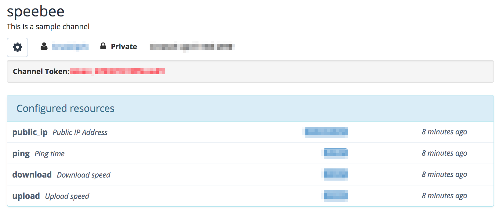

SpeeBee
-------

This repository contains the code for a simple speed test command line that
posts to BeeBotte.com.

Intention
---------

I wanted something that would run consistent tests consistently and would be
easily deployable.

Technologies used
-----------------

* SpeedTest cli
* BeeBotte.com

Setup
-----

Before you deploy your docker container, register with BeeBotte.com.

Once logged into Beebotte:

* Click Channels
* Click Create New
* Under 'Channel Name' enter ***speebee***
* Under ***configured resources*** add four as follows:
  * public_ip - Type: text
  * ping - Type: number
  * download - Type: speed
  * upload - Type: speed
* Click 'Create Channel'

Leave SoS unticked for each resource.

The result should look like this:

***Take note of the 'Channel Token'. We will use that in the next step.

--
